# Phase Taxonomy and DAG — Freeze Candidate

> **Historical, non-normative design note.** Approval, freeze, authority,
> attestation, digest-chain, and activation-gate language below is retained only
> to explain project history. Current policy is defined by `AGENTS.md`,
> `CONTRIBUTING.md`, `.github/BRANCH_POLICY.md`, the implementation, and tests.

Status: `freeze_candidate`, not approved or scored evidence.

This taxonomy preserves the useful names in the historical nine-event
prototype while fixing the false assumption that an online streaming request
is one linear chain. Decode, serialization, delivery, and communication can
overlap; the normalized representation must therefore be a DAG of spans and
dependency edges.

```mermaid
flowchart LR
    R[received] --> F[render / request normalization]
    F --> T[tokenization]
    T --> Q0[queue epoch e]
    Q0 --> A0[admission epoch e]
    A0 --> P0B[prefill begin epoch e]
    P0B --> P0E[prefill end epoch e]
    P0E --> FT[first token ready]
    FT --> OF[first output batch ready]
    FT -. if more tokens .-> D0B[decode begin epoch e]
    D0B --> D0E[decode end epoch e]
    P0B -. child span .-> CP0[communication span]
    CP0 --> P0E
    D0B -. child span .-> CD0[communication span]
    CD0 --> D0E
    P0B -. preempted .-> X0[epoch e suspended]
    D0B -. preempted .-> X0
    X0 --> Q1[requeued epoch e+1]
    Q1 --> A1[admission epoch e+1]
    A1 --> P1B[prefill/resume begin epoch e+1]
    P1B --> P1E[prefill/resume end epoch e+1]
    P1E --> D1B[decode begin epoch e+1]
    D1B --> D1E[decode end epoch e+1]
    D0B -. produces .-> O0[output batch ready]
    D1B -. produces .-> O1[output batch ready]
    OF -. max_tokens=1 .-> G[generation done]
    O0 -. if final .-> G
    O1 -. if final .-> G
    O0 -. explicit handoff edge .-> HR[frontend output ready]
    O1 -. explicit handoff edge .-> HR
    OF -. explicit handoff edge .-> HR
    G --> EC[engine resource cleanup]
    EC -. final EngineCoreOutput .-> HR
    HR -. response dependency .-> S[serialize chunk]
    S --> Y[transport send return]
    D0E --> G
    D1E --> G
    Y -. final chunk .-> SD[stream done]
    G -. engine child terminal .-> RD[root request done]
    SD -. response child terminal .-> RD
    RD --> C[cleanup done]
    X[abort / cancel / error] --> C
```

Serialization and transport branches repeat per chunk and can overlap the
decode span. The diagram unrolls one possible preemption into a fresh epoch;
additional preemptions create fresh later-epoch nodes rather than a back edge.
Normal-completion and preemption branches are mutually exclusive for one
concrete epoch; the diagram shows the union of allowed trace shapes.
Communication is represented by separate child spans, never a phase self-loop.
Engine resource cleanup occurs after the core terminal and before the final
EngineCoreOutput reaches root-scope frontend output processing; it is not
delayed for an HTTP acknowledgement.
There is deliberately no transport-to-decode edge here. The concrete
normalizer emits only dependency edges observed or guaranteed by the runtime.

## Phase boundaries

| Phase | Start boundary | End boundary | Primary owner | Critical rule |
| --- | --- | --- | --- | --- |
| Frontend/render | Earliest instrumented API, AsyncLLM, or LLMEngine boundary accepts a request and creates `trace_id` | Engine-ready rendered or direct input exists | `frontend` | Do not export prompt, message, or auth content. |
| Tokenization | Tokenization begins after render | All engine input tokens are ready | `tokenizer` | Cache-hit and pre-tokenized paths need explicit mode attributes. |
| Queue | Initial `queued`, or scheduler-owned `requeued` after preemption | `admission_started` when the scheduler selects the request for a budget | initial: `engine_client`; requeue: `engine_core` | `queued` is exactly once per engine lifecycle; the propagated queue span includes client/IPC wait. |
| Admission | `admission_started` after queue selection | Initial `scheduled` or post-preemption `resumed` when admitted work is handed to execution | `engine_core` | Do not derive it from optional stats logging. |
| Prefill | Prompt cache resolution or prompt work for an epoch begins | Required KV state for first-token generation is ready | `engine_core` | P1 formal support is local homogeneous KV cache; a maximal hit leaves a nonempty suffix after a block-aligned cached prefix. |
| Decode | Later-token work after the first output token begins | That epoch's aggregate later-token work ends | `engine_core` | `generation_done` is the separate pre-cleanup `engine_core` terminal; `max_tokens=1` has no decode span. |
| Communication | A versioned host/device, collective, transfer, or synchronization span begins | The same span ends | `external_evidence` issue-2 adapter | Absence is legal only for frozen `communication_mode=none`; otherwise issue #2 owns the required profile. |
| Serialization | A response object or chunk starts conversion to wire bytes | Bytes are handed to the transport send API | `response` | It may overlap decode; per-chunk identity is required. |
| Delivery | Transport send is invoked for a chunk | `delivery_done` for a non-final chunk or `stream_done` for the final chunk | `transport` | The final chunk emits `stream_done`, never both names; this proves server transport acceptance, not client receipt. |
| Cleanup | A lifecycle's owning component begins releasing request state after its effective terminal | That same component emits its scoped `cleanup_done` | root: `frontend`; engine: `engine_core`; response: `response` | Trace completeness aggregates the cleanup of all activated lifecycles; an unclean process shard makes the entire shard ineligible for formal evidence. |

## Terminal and invalid paths

Terminal choice is scope-specific under one deterministic precedence rule:
root requests use `request_done|cancelled|error`; engine samples use
`generation_done|aborted|cancelled|error`; responses use
`stream_done|cancelled|error`. Every `lifecycle_id` has one effective terminal
outcome; one `trace_id` may contain a root lifecycle, zero or more engine
samples, and an optional response lifecycle. A terminal before accepted engine
submission therefore has no engine child. Cleanup completeness requires all
component-scoped events in the frozen mode roster; an unclean process shard
makes the entire shard ineligible because final loss state is unknown. Missing,
duplicate, inverted, dropped,
or unresolved cross-domain events are never repaired by guessing timestamps.

## Prototype mapping

The historical `received`, `tokenized`, `queued`, `scheduled`, `prefill_done`,
`first_token`, `decode_done`, `stream_done`, and `cleanup_done` names remain a
migration vocabulary. Before P1 they require four semantic corrections:

1. `stream_done` moves from the internal output queue to the HTTP/SSE send
   boundary; an internal output-complete observation needs a different name.
2. Admission and lifecycle events must be independent of `--disable-log-stats`.
3. Epoch, terminal, chunk, clock-domain, and canonical identity fields become
   first-class schema data rather than inferred metadata.
4. Legacy terminal `decode_done` maps to `generation_done`; the new
   `decode_done` closes only an aggregate later-token span and is absent for
   `max_tokens=1`.

Fine-grained prefill/decode/communication spans may extend this taxonomy, but
they cannot silently redefine these request-level boundaries.

## Executable span and edge vocabulary

Every span has one `span_id`, a start and end event, one owning component, and
one scope. Events encode these as `start_span_id` and `end_span_id`; a shared
boundary may end one span and start the next without reusing an ID. The freeze
candidate pairs are:

| Phase | Start | End | Scope |
| --- | --- | --- | --- |
| Render | `render_started` | `render_done`; root `cancelled/error` closes without completion | root request |
| Tokenization | `tokenization_started` | `tokenization_done`; root `cancelled/error` closes without completion | actual tokenizer invocation only |
| Queue | initial `queued` or post-preemption `requeued` | `admission_started`; engine terminal closes without completion | engine sample + epoch |
| Admission | `admission_started` | initial `scheduled` or post-preemption `resumed`; engine terminal closes without completion | engine sample + epoch |
| Prefill | `prefill_started` | `prefill_done`; `preempted` suspends; terminal control closes without completion | engine sample + epoch |
| Decode | `decode_started` | `decode_done`; `preempted` suspends; engine terminal closes without completion | engine sample + epoch |
| Communication | `communication_started` | `communication_done`; engine terminal closes without completion | typed operation; preemption while open is invalid |
| Serialization | `serialization_started` | `serialization_done`; response `cancelled/error` closes without completion | response + chunk |
| Delivery | `delivery_started` | non-final `delivery_done`, final `stream_done`, or response `cancelled/error` | response + chunk |
| Cleanup | `cleanup_started` | `cleanup_done` | lifecycle + component |

Dependency edges are explicit runtime `edge` records carrying `edge_id`,
`from_event_id`, `to_event_id`, `edge_kind`, and `evidence_source`; the
normalizer does not infer them from global record or timestamp order. Allowed
kinds are program order, data dependency, submission, parent/child, transport
handoff, and explicitly correlated same-clock-domain order. Engine
`output_batch_ready` first links to root `output_ready`; that root event links
to response `serialization_started` using propagated source IDs and a matching
`handoff_id`. Program order is limited to one
instrumented logical execution context. A missing endpoint, unsupported source,
cross-trace edge, or cycle invalidates the trace. An overlap annotation is
never treated as happens-before.
